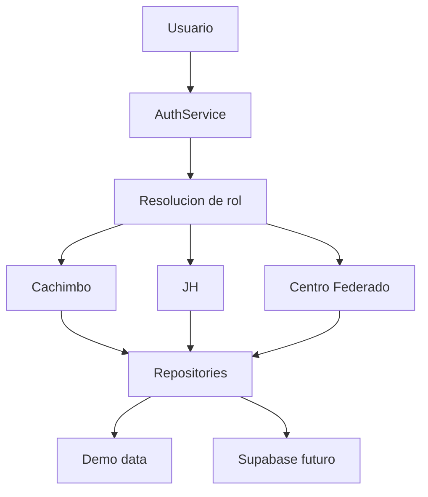
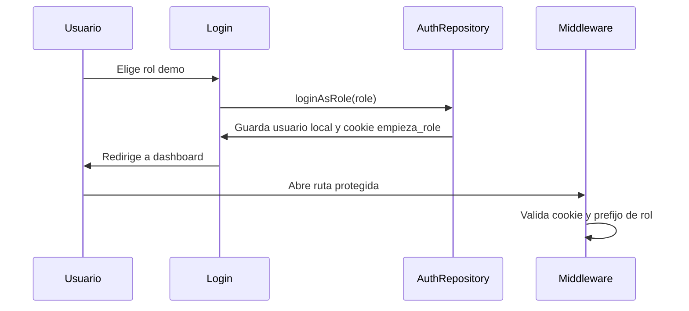

# Arquitectura de Empieza PUCP

Empieza PUCP es un monolito modular. Una sola aplicacion Next.js entrega experiencias distintas para Cachimbo, JH y Centro Federado segun el rol autenticado.

## Diagrama General



## Monolito Modular

La estructura principal vive en `src/features`. Cada dominio contiene su logica, repositorios y componentes especificos cuando aplica. `src/components` guarda piezas reutilizables de interfaz sin reglas de negocio.

## Flujo de Autenticacion



`AuthService` decide entre `DemoAuthRepository` y `SupabaseAuthRepository`. En modo demo se usa localStorage para sesion de cliente y cookie `empieza_role` para proteccion de rutas en middleware.

## Roles

`UserRole` se define como:

```ts
type UserRole = "student" | "jh" | "cf";
```

Las rutas protegidas son:

- `/cachimbo/*`: student.
- `/jh/*`: jh.
- `/cf/*`: cf.

## Data Access Layer

Los componentes llaman repositorios como:

- `getStudentOnboarding`
- `getStudentCourseGrades`
- `getCampusPlaces`
- `getJhDashboard`
- `getCfContent`

La decision importante es que no hay llamadas directas a Supabase dentro de componentes React. Esto permite avanzar en hackathon con demo data y migrar gradualmente a datos reales.

## Supabase

La migracion inicial crea tablas, enums, llaves foraneas, indices y RLS. Las politicas preparan tres ideas:

- Cachimbo: datos propios, informacion publica y su grupo.
- JH: estudiantes y checklist de su horario.
- CF: contenido, JH y horarios de su facultad.

## Estrategia Demo

La demo incluye usuarios conceptuales:

- Andrea como cachimbo.
- Maria Fernanda Rios como JH.
- Centro Federado como CF.

Los datos viven en `src/features/demo/demo-data.ts` y alimentan todos los repositorios actuales.

## Mapa

El mapa usa MapLibre y GeoJSON demo en `public/campus`. `campus-map.repository.ts` abstrae los lugares y rutas. El pathfinding actual usa Dijkstra para un grafo pequeno; si se cargan datos reales del campus, se puede reemplazar o ampliar por A* usando distancia geografica como heuristica.

## Onboarding

El onboarding tiene fases:

- `before_classes`
- `first_week`
- `first_month`
- `during_semester`

El progreso se calcula desde registros completados, no desde porcentajes hardcodeados.

## Grades

El modulo `grades` contiene funciones puras:

- `calculateWeightedGrade`
- `calculateCategoryAverage`
- `calculateProjectedGrade`
- `calculateRequiredGrade`

La UI de AMGA es solo una instancia demo del motor general de evaluaciones ponderadas.
